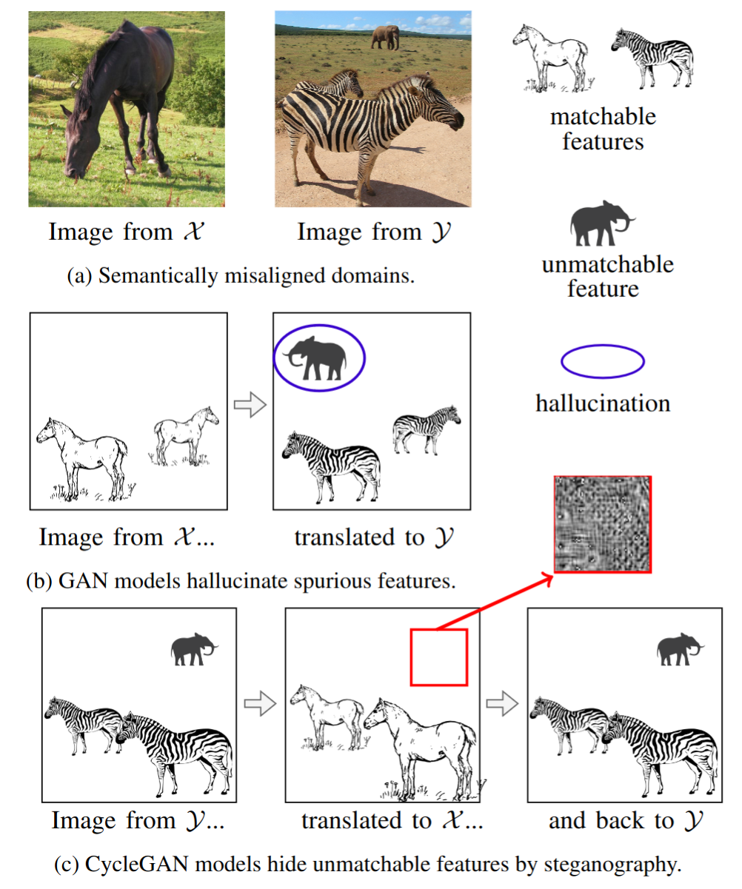
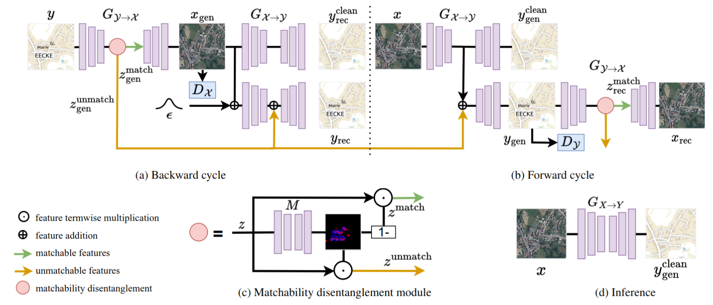
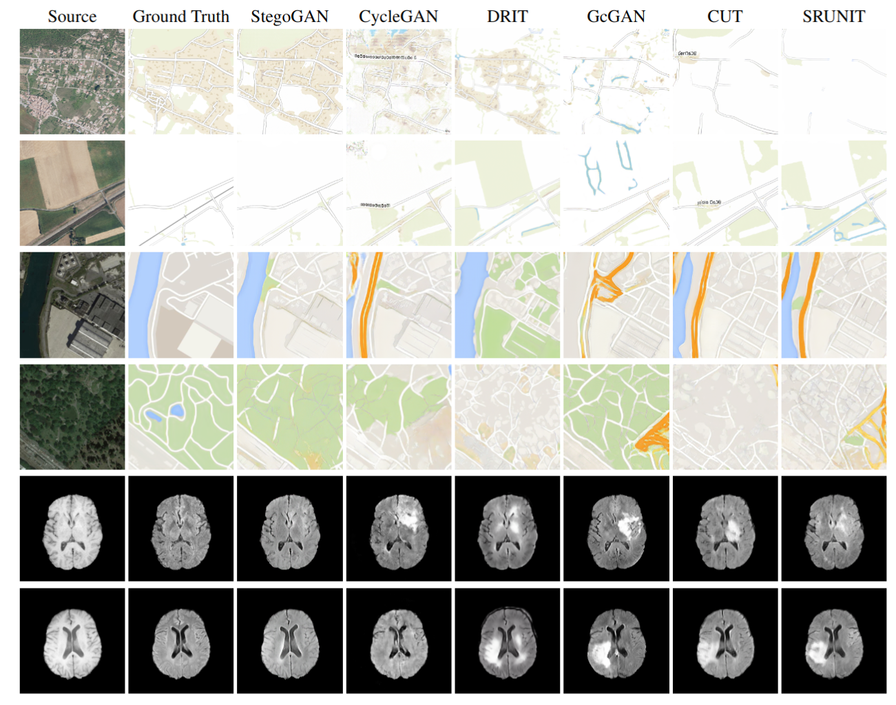

<h4 align="center">
  PyTorch implementation for
</h4>
  
<h3 align="center">
StegoGAN: Leveraging Steganography for <br> Non-bijective Image-to-Image Translation - <a href="https://cvpr.thecvf.com/">CVPR2024</a>
</h3>
<h4 align="center">
Sidi Wu, Yizi Chen, Samuel Mermet, Lorenz Hurni, Konrad Schindler, Nicolas Gonthier, Loic Landrieu
</h4>

<p align="center">

</p>

We introduce StegoGAN:
- A model that use steganography to detect and mitigate semantic misalignment between domains; 
- In settings where the domain mapping is non-bijective (some classes are only in the target domain), StegoGAN achieves superior semantic consistency over other GAN-based models without requiring detection or inpainting steps;
- We propose three datasets from open-access sources as a benchmark for evaluating non-bijective image translation models.

<p align="center">

</p>


### Project Structure

Structure of this repository:

```
|
├── data                         <- Data loader
├── dataset                      <- Dataset for training
│   ├── BRATS_mismatch           <- Brats_mismatch dataset
│   ├── PlanIGN                  <- PlanIGN dataset
|   ├── Google_mismatch          <- Google_mismatch dataset
├── model                        <- Model
│   ├── base_model.py            <- Base model
│   ├── Networks.py              <- Networks
|   ├── stego_gan_model.py       <- StegoGAN model
├── env_stego_gan.yml            <- Conda environment .yml file
├── train.py                     <- Training codes for Stego-GAN
├── test.py                      <- Testing codes for Stego-GAN
└── README.md
```

## Installation 🌠

### 1. Create and activate conda environment

```
conda env create -f env_stego_gan.yml
conda activate env_stego_gan
```

### 2. Download datasets

We propose three datasets for benchmarking non-bijective image-to-image translation, and the datasets can be downloaded from [Zenodo](https://zenodo.org/records/10839841) and placed within the 'dataset/' directory.:

* [**PlanIGN**] This dataset contains 1900 aerial images (ortho-imagery from IGN) at 3m spatial resolution and two associated maps: one with toponyms and one without toponyms (_TU). We divided them into training (1000 images) and testing (900 images). In our experiment, we use trainA & trainB, testA & testB_TU for training and testing, respectively.
* [**Google_mismatch**] We created non-bijective datasets from the [maps dataset](https://github.com/phillipi/pix2pix?tab=readme-ov-file) by seperating the samples with highways from those without. We excluded all satellite images (trainA) featuring highways and subsampled maps (trainB) with varying proportions of highways from 0% to 65%. For the test set, we selected 898 pairs without highways. 
* [**BRATS_mismatch**] We used two modalities of brain MRI from [Brats2018](https://www.med.upenn.edu/sbia/brats2018/data.html) -- T1 and FLAIR. Each scan is classified as tumorous if more than 1% of its pixels were labelled as such and as healthy if it contains no tumor pixels. We provide "generate_mismatched_datasets.py" so users can generate datasets with varying proportions of tumorous samples during training. In our default setting, we have 800 training samples with source images (T1) being healthy and target images (FLAIR) comprising 60% tumorous scans. The test set contains 335 paired scans of healthy brains. 

### 3. Download weights for inference or pre-training

The pre-trained weights can be downloaded from:
* [**Google_mismatch**] The checkpoints with varing proportions of highways can be downloaded [here](https://drive.google.com/file/d/11sesOtokRomVvM2rHRcv2nSWT4_nONGR/view?usp=sharing). 
* [**PlanIGN**] Both checkpoints for best image translation results and mismatch detection (texts) can be downloaded [here](https://drive.google.com/file/d/1ZDwGFpJh1ZAEeGTK-S3UDRyDYFwiWTLo/view?usp=sharing).
* [**BRATS_mismatch**] To be relased...

## Trainin and Inference 🚀

### 1. Training

* For example: training StegoGAN with Google_mismatch dataset
```
python train.py --dataroot ./dataset/Google_mismatch/0.65 \
                --name google_stego_0.65 \
                --model stego_gan \
                --gpu_ids 0 \
                --lambda_reg 0.3 \
                --lambda_consistency 1 \ 
                --resnet_layer 8 \
                --batch_size 1  \
                --fusionblock \
                --n_epochs 100
```
For PlanIGN
```
python train.py --dataroot ./dataset/PlanIGN \
                --name planIGN_stego \
                --model stego_gan \
                --gpu_ids 0 \
                --lambda_reg 0.25 \
                --lambda_consistency 1 \ 
                --resnet_layer 8 \
                --batch_size 1  \
                --fusionblock \
                --load_size 256 \
                --n_epochs 100
```                
Training results and weights are saved at `checkpoints/<name>`.

### 2. Inference
```
python test.py --dataroot ./dataset/Google_mismatch \ 
               --name google_stego_0.65 \ 
               --model stego_gan \
               --phase test \
               --no_dropout \
               --resnet_layer 8
```
Inferencing results will be saved at `results/<model_name>/test_latest`.

### 2. Evaluating results
For Google_mismatch
```
python evaluation/evaluate_google.py \
       --gt_path ./results/google_stego_0.65/test_latest/images/real_B \
       --pred_path ./results/google_stego_0.65/test_latest/images/fake_B_clean \
       --output_path ./results/google_stego_0.65/test_latest \
       --dataset Google \
       --method StegoGAN
```
For PlanIGN
```
python evaluation/evaluate_IGN.py \
       --gt_path_TU ./dataset/PlanIGN/testB_TU \ 
       --gt_path_T ./dataset/PlanIGN/testB \
       --pred_path ./results/PlanIGN/test_latest/images/fake_B_clean \
       --pred_path_mask ./results/PlanIGN/test_latest/images/latent_real_B_mask_upsampled \
       --output_path ./results/PlanIGN/test_latest \
       --dataset PlanIGN \
       --method StegoGAN 
```
For Brats_mismatch
```
python evaluation/evaluate_brats.py \
       --gt_path ./results/Brats/test_latest/images/real_B \
       --pred_path ./results/Brats/test_latest/images/fake_B_clean \
       --output_path ./results/Brats/test_latest \
       --seg_save_path ./results/Brats/test_latest/images/fake_B_tumor \
       --dataset Brats \
       --method StegoGAN
```

## Qualitative results 🥰

<p align="center">

<\p>

## Citation
If you use our code or our datasets, please cite our [paper](https://openaccess.thecvf.com/content/CVPR2024/papers/Wu_StegoGAN_Leveraging_Steganography_for_Non-Bijective_Image-to-Image_Translation_CVPR_2024_paper.pdf)
```
@inproceedings{wu2024stegogan,
  title={{StegoGAN: L}everaging Steganography
for Non-Bijective Image-to-Image Translation},
  author={Wu, Sidi and Chenn Yizi and Mermet, Samuel and Hurni, Lorenz and Schindler, Konrad and Gonthier, Nicolas and Landrieu, Loic},
  booktitle={IEEE Conference on Computer Vision and Pattern Recognition (CVPR)},
  year={2024}
}
```

If you want to use the Google_mismatch dataset, please also cite the following paper:
```
@inproceedings{isola2017image,
  title={Image-to-Image Translation with Conditional Adversarial Networks},
  author={Isola, Phillip and Zhu, Jun-Yan and Zhou, Tinghui and Efros, Alexei A},
  booktitle={IEEE Conference on Computer Vision and Pattern Recognition (CVPR)},
  year={2017}
}
```
If you want to use the Brats_mismatch dataset, please also cite the following papers:
```
@article{menze2014multimodal,
  title={The multimodal brain tumor image segmentation benchmark (BRATS)},
  author={Menze, Bjoern H and Jakab, Andras and Bauer, Stefan and Kalpathy-Cramer, Jayashree and Farahani, Keyvan and Kirby, Justin and Burren, Yuliya and Porz, Nicole and Slotboom, Johannes and Wiest, Roland and others},
  journal={IEEE transactions on medical imaging},
  volume={34},
  number={10},
  pages={1993--2024},
  year={2014}
}
@article{bakas2017brats17,
  title={Advancing the cancer genome atlas glioma MRI collections with expert segmentation labels and radiomic features},
  author={Bakas, Spyridon and Akbari, Hamed and Sotiras, Aristeidis and Bilello, Michel and Rozycki, Martin and Kirby, Justin S and Freymann, John B and Farahani, Keyvan and Davatzikos, Christos},
  journal={Scientific data},
  volume={4},
  number={1},
  pages={1--13},
  year={2017}
}
@article{bakas2018ibrats17,
  title={Identifying the best machine learning algorithms for brain tumor segmentation, progression assessment, and overall survival prediction in the BRATS challenge},
  author={Bakas, Spyridon and Reyes, Mauricio and Jakab, Andras and Bauer, Stefan and Rempfler, Markus and Crimi, Alessandro and Shinohara, Russell Takeshi and Berger, Christoph and Ha, Sung Min and Rozycki, Martin and others},
  journal={arXiv preprint arXiv:1811.02629},
  year={2018}
}
```


## Acknowledgement
We are thankful for the great open-source code of [Cycle-GAN](https://github.com/junyanz/pytorch-CycleGAN-and-pix2pix).

## Changelog
### 2024.10.29 ###
Update the configurations for training Google_mismatch and PlanIGN. Thanks for the reminder of @guyleaf.
